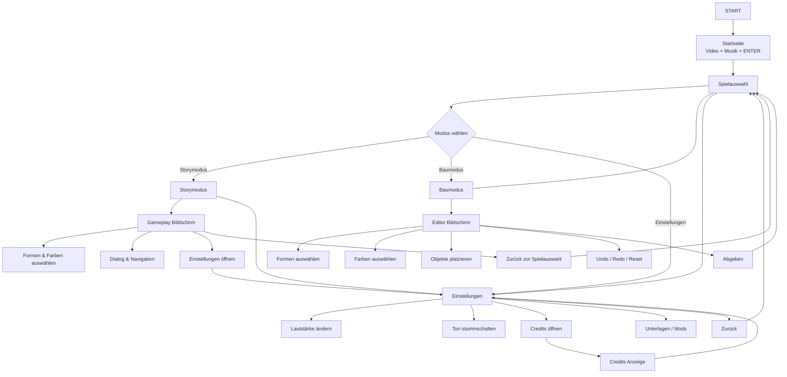

```mermaid
flowchart TD

A[START] --> B[Startseite<br>Video + Musik + ENTER]

B --> C[Spielauswahl]

C --> D{Modus wählen}

%% HAUPTENTSCHEIDUNG
D -->|Storymodus| E[Storymodus]
D -->|Baumodus| F[Baumodus]
D -->|Einstellungen| G[Einstellungen]

---

%% STORYMODE
E --> E1[Gameplay Bildschirm]
E1 --> E2[Formen & Farben auswählen]
E1 --> E3[Dialog & Navigation]
E1 --> E4[Einstellungen öffnen]
E1 --> E5[Zurück zur Spielauswahl]

E4 --> G
E5 --> C

---

%% BUILDMODE
F --> F1[Editor Bildschirm]
F1 --> F2[Formen auswählen]
F1 --> F3[Farben auswählen]
F1 --> F4[Objekte platzieren]
F1 --> F5[Undo / Redo / Reset]
F1 --> F6[Abgeben]

F6 --> C

---

%% EINSTELLUNGEN
G --> G1[Lautstärke ändern]
G --> G2[Ton stummschalten]
G --> G3[Credits öffnen]
G --> G4[Unterlagen / Mods]
G --> G5[Zurück]

G3 --> H[Credits Anzeige]
H --> G
G5 --> C
```